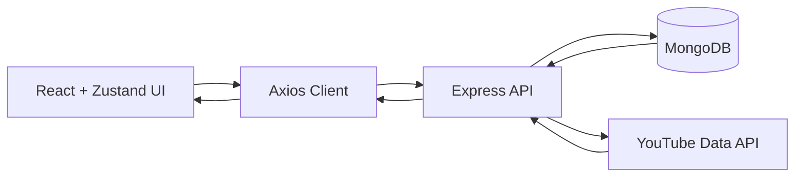

<div align="center">


[](https://github.com/SkTheAdvanceGamer/RhythmicTunes)

<p>
  
  
  
  
</p>

<p>
  
  
  
  
</p>

</div>

---

## Table of Contents
1. [Project Vision](#project-vision)
2. [Experience Highlights](#experience-highlights)
3. [Architecture](#architecture)
4. [Tech Stack](#tech-stack)
5. [Feature Deep Dive](#feature-deep-dive)
6. [API Surface](#api-surface)
7. [Local Setup](#local-setup)
8. [Environment Variables](#environment-variables)
9. [Admin Bootstrap](#admin-bootstrap)
10. [Troubleshooting](#troubleshooting)
11. [Security Notes](#security-notes)
12. [Contributing](#contributing)

---

## Project Vision
RhythmicTunes is a full-stack music platform designed to feel modern, responsive, and immersive.
It combines:

1. A **reactive frontend UI** that visually responds to playback.
2. A **scalable REST backend** with JWT auth and role-aware behavior.
3. **Dynamic discovery** through local catalog + YouTube-powered search/resolve.
4. **Personal music workflows** (likes, playlists, follows, history, recommendations).

---

## Experience Highlights
<div align="center">

| UI & Motion | Music Intelligence | User Flows |
|---|---|---|
| v3 warm glass shell | YouTube-backed search | Register/Login + JWT |
| Beat-reactive background | Smart fallback for preview tracks | Like/Unlike songs |
| Floating player controls | Trending + recommendation endpoints | Playlist CRUD |
| Icon-driven compact nav | History-driven discovery | Artist follow system |

</div>

### Playback Behavior (Important)
1. App uses in-site player controls for play/pause/seek/volume/queue.
2. If a source is short/preview-only or fails, player attempts YouTube resolution for better continuity.
3. Search can return broader music results via `/api/songs/youtube-search`.

---

## Architecture


### Monorepo Layout
```text
RhythmicTunes/
  client/
    src/
      api/
      components/
      context/
      hooks/
      pages/
      store/
      utils/
  server/
    controllers/
    middleware/
    models/
    routes/
    services/
    utils/
    server.js
  docs/
  README.md
```

---

## Tech Stack
### Frontend
1. React + Vite
2. TailwindCSS
3. Zustand
4. Axios
5. React Router
6. Framer Motion

### Backend
1. Node.js
2. Express.js
3. MongoDB + Mongoose
4. JWT (`jsonwebtoken`)
5. `bcryptjs`
6. Multer

---

## Feature Deep Dive
<details open>
<summary><b>Authentication & Access</b></summary>

1. JWT-based login/register flow.
2. Password hashing with bcrypt.
3. Protected routes and user identity hydration via `/api/auth/me`.
4. Role-aware admin UI visibility (user/admin patterns supported in current code).

</details>

<details open>
<summary><b>Music Playback</b></summary>

1. Sticky/floating in-app player.
2. Queue controls: previous/next/play/pause.
3. Seek bar + volume controls.
4. YouTube fallback/resolve behavior for problematic preview tracks.

</details>

<details open>
<summary><b>Discovery & Recommendations</b></summary>

1. Trending songs endpoint.
2. History-based recommendations.
3. Playlist-based recommendations.
4. Explore and Search pages for local + external music lookup.

</details>

<details open>
<summary><b>Library & Social</b></summary>

1. Liked songs flow.
2. Artist follow/unfollow flow.
3. Playlist creation, update, delete, and song management.
4. Listening history timeline.

</details>

---

## API Surface
### Auth
1. `POST /api/auth/register`
2. `POST /api/auth/login`
3. `GET /api/auth/me`

### Songs
1. `GET /api/songs`
2. `GET /api/songs/:id`
3. `GET /api/songs/search?q=`
4. `GET /api/songs/trending`
5. `GET /api/songs/youtube-search?q=`
6. `GET /api/songs/youtube-resolve?title=&artist=`
7. `POST /api/songs`
8. `DELETE /api/songs/:id`

### Artists
1. `GET /api/artists`
2. `GET /api/artists/:id`
3. `POST /api/artists`
4. `POST /api/artists/:id/follow`

### Playlists
1. `GET /api/playlists`
2. `POST /api/playlists`
3. `GET /api/playlists/:id`
4. `PUT /api/playlists/:id`
5. `DELETE /api/playlists/:id`
6. `POST /api/playlists/:id/songs`
7. `DELETE /api/playlists/:id/songs/:songId`

### History
1. `POST /api/history`
2. `GET /api/history`
3. `DELETE /api/history`

### Recommendations
1. `GET /api/recommendations/history`
2. `GET /api/recommendations/trending`
3. `GET /api/recommendations/playlist`

### Health
1. `GET /api/health`

---

## Local Setup
### Prerequisites
1. Node.js (LTS recommended)
2. MongoDB (local or cloud)
3. npm

### Install
1. Root dependencies:
```bash
npm install
```

2. Backend:
```bash
cd server
npm install
```

3. Frontend:
```bash
cd ../client
npm install
```

### Run
1. Start backend:
```bash
cd server
npm start
```

2. Start frontend:
```bash
cd client
npm start
```

3. Open app:
- [http://localhost:5173](http://localhost:5173)

---

## Environment Variables
### `server/.env`
```env
PORT=5000
MONGO_URI=mongodb://127.0.0.1:27017/rhythmictunes
JWT_SECRET=replace_with_a_strong_secret
YOUTUBE_API_KEY=replace_with_your_key
```

### `client/.env`
```env
VITE_API_URL=http://localhost:5000
```

> `.env` files are ignored by Git and should never be committed.

---

## Admin Bootstrap
From `server/`:
```bash
npm run create-admin
```

Default credentials (development only):
1. Email: `admin@rhythmictunes.com`
2. Password: `admin123`

---

## Troubleshooting
1. **Login fails**:
   Run `npm run create-admin` again from `server/`, then restart backend.
2. **Search returns empty**:
   Verify `YOUTUBE_API_KEY` in `server/.env` and check backend logs.
3. **UI looks stale after updates**:
   Hard refresh browser (`Ctrl + Shift + R`).
4. **Port/API mismatch**:
   Ensure `VITE_API_URL` points to active backend URL.

---

## Security Notes
1. Rotate API keys periodically.
2. Use a strong JWT secret.
3. Change default admin password before production deployment.
4. Enforce HTTPS and CORS restrictions in production.

---

## Contributing
1. Fork repository.
2. Create a feature branch.
3. Keep commits scoped and descriptive.
4. Open PR with summary and test notes.

---

<div align="center">

### Built with focus, rhythm, and clean architecture.


</div>
